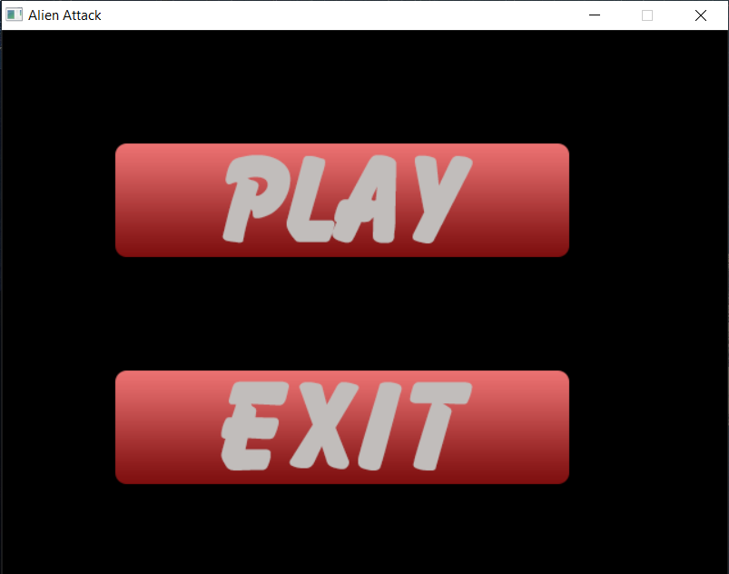

# Alien attack demo

---

The demo consists of two levels. Each level has up to 5 types of enemies and 1 boss.

The demo is implemented based on SDL2.
This app has been created for training purposes only!

The build is set up for Windows.

## Toolchain

- IDE: Qt Creator
- Compiler: GCC 7.3.0
- CMake: 3.21
- Sandbox: MinGW64

## Used libraries

| Library       | Version       |
| ------------- | -------------:|
| Base64        |             - |
| SDL2          |        2.0.18 |
| SDL2_image    |         2.0.5 |
| SDL2_mixer    |         2.0.4 |
| SDL2_ttf      |        2.0.18 |
| STL           |             - |
| TinyXML       |         2.6.2 |
| ZLib          |             - |

## Additional implemented subprojects

**Logger** is a self-written library for logging information.

## About the demo

### In-game controls

**ESC** - to pause
**Arrows** - for movement
**Space** - to shoot

### Screenshots

**Main Menu**

​

**Introduction**

​

**Gameplay**

​

​

​

​

​